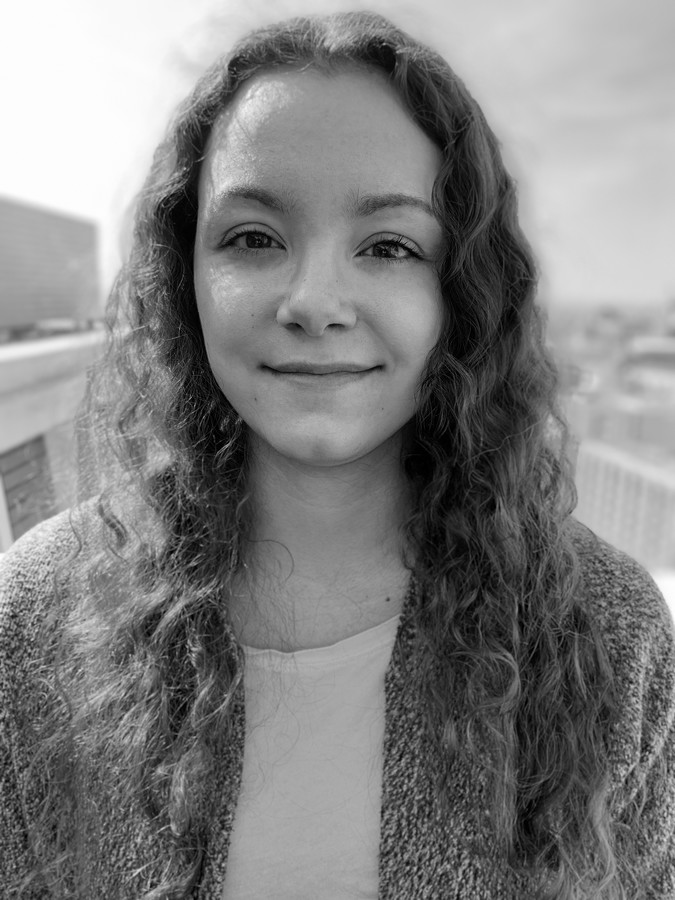

{#id .class height=200px}

I studied Economics and Statistics at the [University of Geneva](https://www.unige.ch/gsem/en/programs/bachelor/description/) (2015-18) as an undergrad and went on to obtain an MSc in Statistics at [Imperial College London](https://www.imperial.ac.uk/statistics) (2019). My MSc dissertation focussed on developing statistical models and efficient algorithms to reconstruct epidemic transmission chains from deep sequence data.
I am now doing a PhD within the [CDT in Modern Statistics and Statistical Machine Learning](https://statml.io/) between Imperial and Oxford. I remain interested in statistical modelling, computational methods and stochastic processes with applications in the bio-medical sciences. I also have a growing interest in Bayesian statistics.

